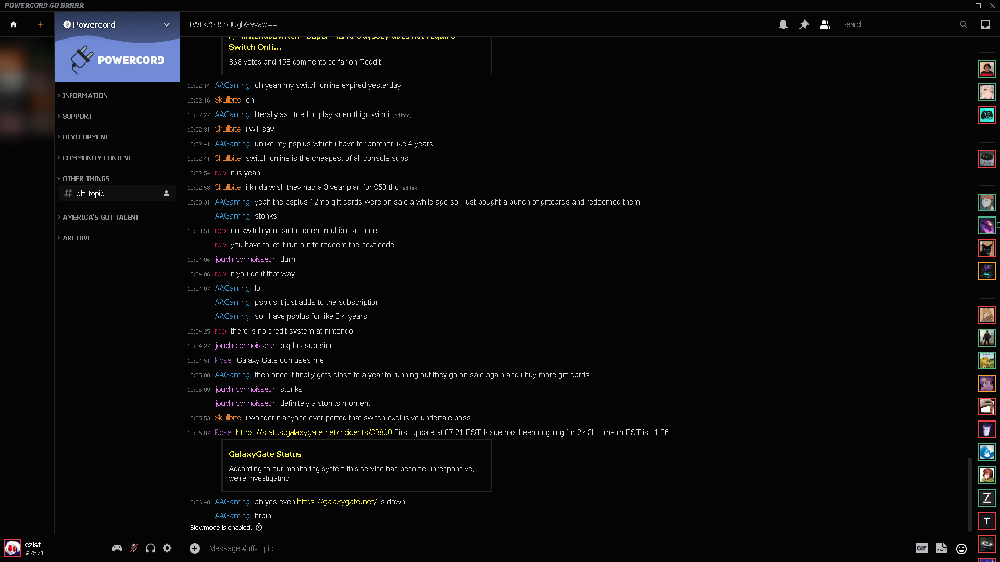

# ezist's shit
this is a "theme" that I made  
it's more like a collection of CSS that ended up turning into something kind of okay

you could technically call this an AMOLED theme I guess  
this is compatible with **no** themes as far as I know

# screenshots

# installation
`cd powercord/src/Powercord/themes && git clone https://github.com/ezist/ezist-theme.git`